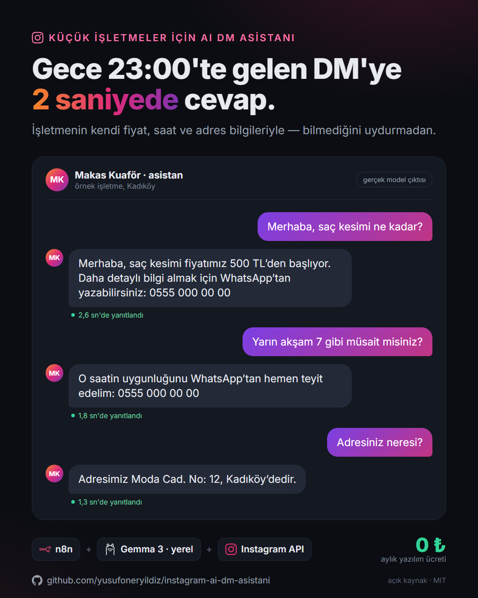

# Instagram AI DM Asistanı

Küçük işletmeler için Instagram DM'lerine 7/24 cevap veren yapay zekâ asistanı.
[n8n](https://n8n.io) ile kurulur, yapay zekâ modeli **kendi bilgisayarınızda** çalışır:
mesaj başına ücret, aylık abonelik yok.



> Kuaför, kafe, güzellik salonu, emlakçı… Müşteri gece 23:00'te "fiyat ne kadar?" yazdığında
> cevap sabahı beklemesin. Hazır SaaS araçlar bu iş için ayda $15–100 istiyor; bu akış
> ücretsiz araçlarla aynı işi yapıyor.

## Ne yapar?

- Instagram'a gelen DM'yi okur, **işletmenin kendi bilgileriyle** (fiyat, saat, adres) kısa ve
  doğal Türkçe cevap verir.
- Konuşma geçmişini hatırlar (son 15 mesaj), art arda gelen mesajları birleştirip tek cevap verir.
- "Görüldü" ve "yazıyor…" göstergelerini kullanır; cevap insan yazıyormuş gibi gelir.
- Randevu/ayrıntı isteyen müşteriyi **WhatsApp'a yönlendirir** — satışı insan kapatır.
- Gönderiye **"fiyat", "bilgi", "randevu"** ya da **"dm"** yorumu yazana otomatik özel DM atar.
- Bilmediği konuda söz vermez, fiyat uydurmaz; sorulursa yapay zekâ olduğunu dürüstçe söyler.

## Maliyet

| Parça | Araç | Ücret |
|---|---|---|
| Otomasyon | n8n (kendi sunucunuzda, Docker) | 0 ₺ |
| Yapay zekâ | Gemma 3 4B, [Ollama](https://ollama.com) ile yerel | 0 ₺ |
| Instagram bağlantısı | Meta Instagram API (kendi hesabınız) | 0 ₺ |
| Dışarıdan erişim | Cloudflare Tunnel | 0 ₺ |

Tek şart: akışın çalıştığı bilgisayarın açık olması (8 GB RAM yeterli). 7/24 çalışması için
düşük maliyetli bir sunucuya (VPS) taşınabilir ya da model düğümü bulut bir modelle
(ör. Gemini Flash ücretsiz katman) değiştirilebilir.

## Nasıl çalışır?

```
Instagram DM ──► Meta Webhook ──► n8n
                                   │
          ┌── metin mi? kendi mesajımız mı? (filtre)
          ▼
   Data Table'a kaydet ──► "görüldü" ──► son 15 mesajı getir
          │
          ▼
   "yazıyor…" ──► Gemma 3 (yerel) cevap yazar ──► parçala, gönder ──► geçmişi güncelle

Gönderi yorumu ("fiyat", "bilgi"…) ──► yorum yazana özel DM
```

## Kurulum (~45 dk, bir kez)

### 1 · Instagram ve Meta uygulaması
1. Instagram hesabı **Profesyonel (İşletme)** olmalı.
2. [developers.facebook.com](https://developers.facebook.com) → **Uygulama oluştur** →
   kullanım durumu: *"Instagram'da mesajları ve içeriği yönet"*.
3. Instagram → **API setup with Instagram login** → hesabınızı ekleyin. İzinler:
   `instagram_business_basic`, `instagram_business_manage_messages`,
   `instagram_business_manage_comments`. Kendi hesabınız için App Review gerekmez.
4. **Generate token** → uzun ömürlü erişim jetonunu kopyalayın (60 gün geçerli, 50. günde yenileyin:
   `https://graph.instagram.com/refresh_access_token?grant_type=ig_refresh_token&access_token=<jeton>`).

### 2 · n8n, Ollama ve tünel
```bash
# yapay zekâ modeli
ollama pull gemma3:4b

# n8n
docker run -d --name n8n -p 5678:5678 -v n8n_data:/home/node/.n8n n8nio/n8n

# herkese açık HTTPS adresi (Meta webhook için gerekli)
cloudflared tunnel --url http://localhost:5678
```
n8n'i tünelin verdiği adresle başlatın (`WEBHOOK_URL=https://....trycloudflare.com`), aksi halde
webhook adresi `localhost` görünür.

### 3 · Akışı içe aktarın
1. n8n → **Import from File** → `workflow/instagram-ai-dm-asistani.json`
2. **Settings → Variables** → `IG_ACCESS_TOKEN` = 1. adımdaki jeton.
   (Variables sizin n8n sürümünüzde yoksa jetonu `Set Context` ve `Yorum yazana DM`
   düğümlerine doğrudan yazın.)
3. **Gemma 3** düğümü → Ollama kimliği ekleyin: `http://localhost:11434`
   (n8n Docker'daysa `http://host.docker.internal:11434`).
4. **Data Tables** → `instagram_dm_mesajlar` adında tablo oluşturun, sütunlar:
   `page_id` (metin), `user_id` (metin), `user_text` (metin), `page_text` (metin), `processed` (boolean).
   Tablo kullanan dört düğümde bu tabloyu seçin.
5. **Process Merged Message** düğümünü açın, `[KÖŞELİ PARANTEZLİ]` alanları işletmenizin
   bilgileriyle doldurun. Aynısını `Yorum yazana DM` düğümündeki mesaj için yapın.

### 4 · Webhook'u bağlayın
1. Akışı **Active** yapın (doğrulama yalnızca production adresiyle çalışır).
2. Meta uygulaması → Instagram → **Webhooks** → Callback URL:
   `<n8n adresiniz>/webhook/instagram-dm`, doğrulama jetonu: istediğiniz bir kelime → **Verify**.
3. Abone olunacak alanlar: `messages`, `comments`.
4. Başka bir hesaptan DM atın ve bir gönderiye "fiyat" yorumu yazarak test edin.

## Kendi işletmenize uyarlama

Asistanın bildiği her şey tek bir yerde: **Process Merged Message** düğümündeki sistem mesajı.
Fiyat listesi, çalışma saati, sık sorulan sorular, itirazlara cevaplar oraya yazılır.
Yorumda tetiklenecek kelimeler `Anahtar kelime yorumu mu?` düğümündeki düzenli ifadededir.

## Durum

- **Yapay zekâ kısmı test edildi:** görseldeki cevaplar, bu repodaki sistem mesajıyla yerel
  Gemma 3 4B'nin gerçek çıktılarıdır (örnek bir kuaför bilgisiyle; cevap süresi 1-3 sn).
- **Instagram webhook bağlantısı henüz canlı hesapta uçtan uca test edilmedi.** Akış, n8n.io'da
  yayınlanmış şablonların Graph API çağrılarını aynen kullanıyor; kurup deneyenlerin geri
  bildirimine açığım.

Testte öğrenilen: küçük model, randevu takvimini göremediği halde "müsaitiz" diye cevap
uydurabiliyordu. Sistem mesajının sonuna eklenen "EN ÖNEMLİ KURAL" bölümüyle bu 4/4 denemede
düzeldi. Kendi kurallarınızı eklerken en kritik olanı en sona yazın.

## Kaynak ve teşekkür

Sıfırdan yazılmadı; n8n topluluk şablonlarından uyarlandı:
- [n8n.io/workflows/14026](https://n8n.io/workflows/14026) — mesaj birleştirme, geçmiş ve gönderim iskeleti
- [n8n.io/workflows/6632](https://n8n.io/workflows/6632) — AI sosyal medya otomatik cevaplayıcı
- [n8n.io/workflows/15206](https://n8n.io/workflows/15206) — yorum → özel DM

Uyarlamada: model buluttan yerel Gemma 3'e alındı (ücretsiz), Türkçe işletme asistanı persona'sı
yazıldı, WhatsApp'a yönlendirme ve yorum → DM dalı tek akışta birleştirildi.

## Notlar

- Instagram API, size hiç yazmamış birine mesaj atmaya izin vermez (yalnızca son 24 saatte size
  yazanlara cevap verilebilir); bu asistan
  yalnızca **size yazana** cevap verir. Soğuk DM atmaz, hesabınızı riske sokmaz.
- Yerel model küçük olduğu için sistem mesajını kısa ve net tutun; bilgiler ne kadar açıksa
  cevaplar o kadar isabetli olur.

## Lisans

MIT
